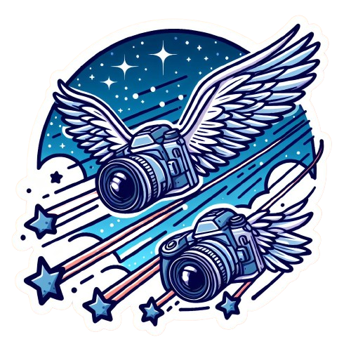

    

<h3 align="center">PLUGIN NAME</h3>

  

   PLUGIN DESCRIPTION
     
    ·
    <a href="https://github.com/ninetailsrabbit/[PLUGIN]/issues/new?assignees=ninetailsrabbit&labels=%F0%9F%90%9B+bug&projects=&template=bug_report.md&title=">Report Bug</a>
    ·
    <a href="https://github.com/ninetailsrabbit/[PLUGIN]/issues/new?assignees=ninetailsrabbit&labels=%E2%AD%90+feature&projects=&template=feature_request.md&title=">Request Features</a>
  

 
 

# Other plugins 🕵️

- Check out my [gists](https://gist.github.com/ninetailsrabbit) You might find some interesting components or configuration files there.
- Grab some useful tools for your Godot projects with [GodotWizards](https://github.com/ninetailsrabbit/GodotWizards)
- Effortless loot generation [Lootie](https://github.com/ninetailsrabbit/Lootie)
